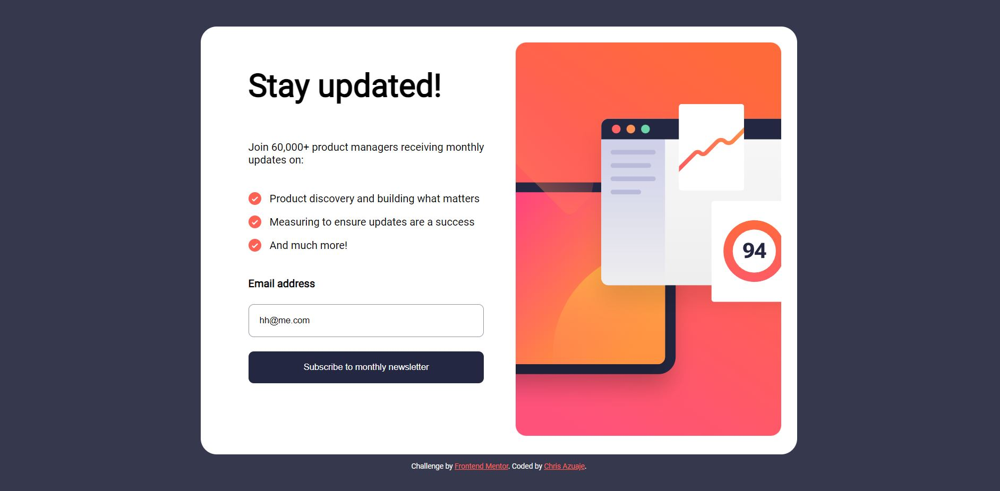

# Frontend Mentor - Newsletter sign-up form with success message solution

This is a solution to the [Newsletter sign-up form with success message challenge on Frontend Mentor](https://www.frontendmentor.io/challenges/newsletter-signup-form-with-success-message-3FC1AZbNrv). Frontend Mentor challenges help you improve your coding skills by building realistic projects.

## Table of contents

- [Overview](#overview)
  - [The challenge](#the-challenge)
  - [Screenshot](#screenshot)
  - [Links](#links)
- [My process](#my-process)
  - [Built with](#built-with)
  - [What I learned](#what-i-learned)
  - [Continued development](#continued-development)
- [Author](#author)

## Overview

### The challenge

Users should be able to:

- Add their email and submit the form
- See a success message with their email after successfully submitting the form
- See form validation messages if:
  - The field is left empty
  - The email address is not formatted correctly
- View the optimal layout for the interface depending on their device's screen size
- See hover and focus states for all interactive elements on the page

### Screenshot



### Links

- Solution URL: [Add solution URL here](https://your-solution-url.com)
- Live Site URL: [Add live site URL here](https://your-live-site-url.com)

## My process

### Built with

- Semantic HTML5 markup
- CSS custom properties
- Flexbox
- CSS Grid
- Mobile-first workflow
- [React](https://reactjs.org/) - JS library
- [Next.js](https://nextjs.org/) - React framework
- [Styled Components](https://styled-components.com/) - For styles

### What I learned

Learned how to replace the list item dots with .svg icons by using the css background-image attribute.

Experimented with various position attributes to get the attribution comment in the correct location.

Improved on skills with the @media query.

Learned how to use the 'git rm <file>' and 'git rm --cached <file>' command to delete a document from github and the local repository.

```css
@media screen and (min-width: 535px);
```

Used the column-reverse attribute to ensure proper placement of the provided image and the form.

```css
.card {
  display: flex;
  flex-direction: column-reverse;
  padding: 0;
}
```

Learned to use both the 'hidden' element in HTML and 'display: none;' in CSS to accomplish the same thing.

```html
<div class="subscribedCard" hidden></div>
```

Used email input value validation for the first time.

```js
function validateEmail() {
  if (
    !emailInput.value.match(/^[A-Za-z\._\-0-9]*[@][A-Za-z]*[\.][a-z]{2,4}$/)
  ) {
    invalidEmailMsg.removeAttribute("hidden");
    emailInput.style.backgroundColor = "#FFCDD2";
  } else {
    signupCard.style.display = "none";
    subscribedCard.removeAttribute("hidden");
    emailInput.style.backgroundColor = "white";
    invalidEmailMsg.setAttribute("hidden", "");
  }
}
```

### Continued development

Readjusting the screen size results in some unwanted layouts so I want to improve on the @media.

I want to improve my project by using React

## Author

- Website - [Add your name here](https://www.your-site.com)
- Frontend Mentor - [@chris-azuaje](https://www.frontendmentor.io/profile/chris-azuaje)
- Twitter - [@chris_azuaje](https://www.twitter.com/chris_azuaje)

**Note: Delete this note and add/remove/edit lines above based on what links you'd like to share.**
